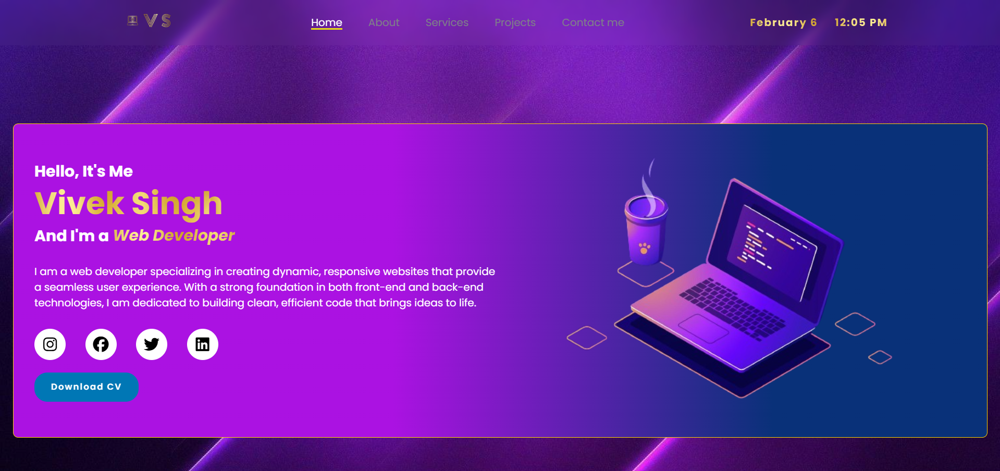

# 🌐 Personal Portfolio

Welcome to my **Personal Portfolio** website! This project showcases my skills, projects, and contact information in a well-structured and visually appealing manner.

## 📂 Project Structure

/img # Images and assets
/about.html # About page
/contact.html # Contact page
/index.html # Main homepage
/project.html # Projects showcase
/service.html # Services provided
/style.css # Global styles
/script.js # JavaScript functionality
/Vivek_resume.pdf # My Resume

markdown
Copy
Edit

## ✨ Features

- **Responsive Design** – Works on all screen sizes 📱💻
- **Smooth Animations** – Adds a modern touch 🎨
- **Interactive UI** – Engaging user experience 🚀
- **Contact Form** – Easy way to reach out 📩

## 🛠️ Technologies Used

- **HTML5** – Structure
- **CSS3** – Styling
- **JavaScript** – Interactivity

## 📸 Preview

## 🚀 Live Demo

🔗 [Check it out here](https://viveks-profile.netlify.app/)

## 📬 Contact

📧 Email: viveks3931@gmail.com  
🔗 [LinkedIn](https://www.linkedin.com/in/vivek3931/) | [GitHub](https://github.com/vivek3931) 

---

⭐ Feel free to fork, contribute, or use it for inspiration!
